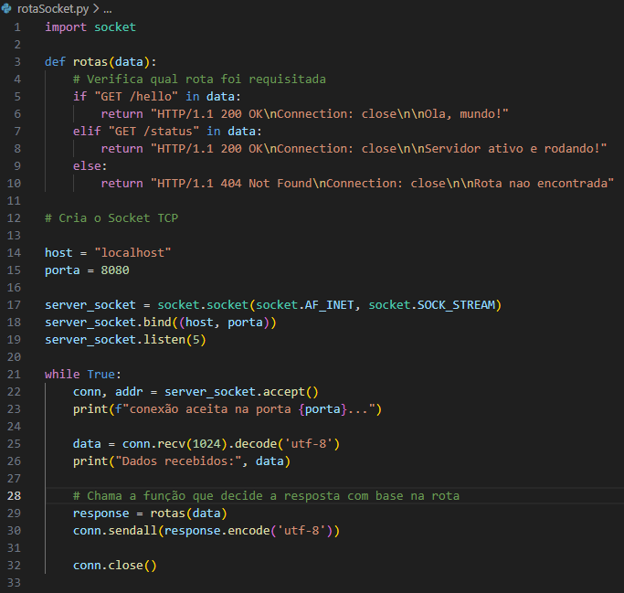
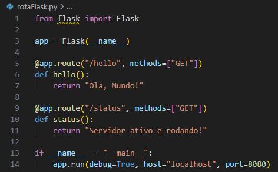

# API com Socket e Flask

A mágica da abstração é transformar esse código de baixo nível escrito com a biblioteca `sockets`:



nessas poucas linhas de código através de framework como `Flask` :


E o que foi abstraído?
- Abertura, escrita, leitura e fechamento de recursos do sistema (Descritores de Arquivo)
- Abertura e fechamento de sockets
- Associação de host com porta de escuta em um socket
- Controle do TCP Three Way Handshake (SYN -> SYN/ACK -> ACK)
- Descrição do Cabeçalho
- Envio de dados e informações
- Abertura e fechamento ou persistência(Keep-alive) da conexão

Tudo isso de forma manual, na unha.

Em resumo, foi abstraído o funcionamento normal de um servidor. Então quando uma API é escrita, na verdade cria-se um servidor HTTP que faz a comunicação entre sockets de quem fornece a informação e quem a consome, isto é, cria-se uma ponte(Interface) de envio e recebiemento de informações entre um ponto e outro.

O interessante é que quando isso é entendido, percebe-se o quanto é CUSTOSO em termos de cpu, memória e rede tanto para o servidor e para quem consome pela quantidade de recurso que precisa ser aberto, manipulado e fechado em cada conexão. Pois quando se fala em recurso aberto trata-se de uma tabela com índices onde o Sistema Operacional organiza e consulta a todo momento o que está sendo executado. Praticamente um pôe casaco, tira casaco incessantemente. E se houver muitos recursos abertos, e não por acaso existe o erro "Too many open files". 

Daí surgem as melhorias como o keep-alive e multiplexação já existentes por padrão nos navegadores mais novos. Onde um mantem a conexão ativa sem ser preciso fazer novamente o `3 Way handshake` e dividir a requisição em várias outras requisições, respectivamente. 

## Ambiente Virtual com Anaconda
```bash
conda create -n flask_api python=3.11
conda activate flask_api
pip install -r requirements.txt
```